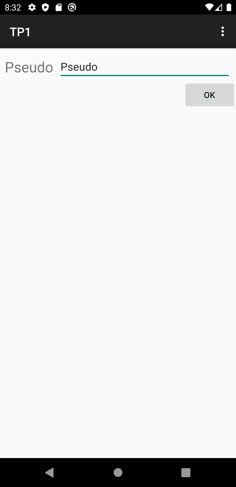
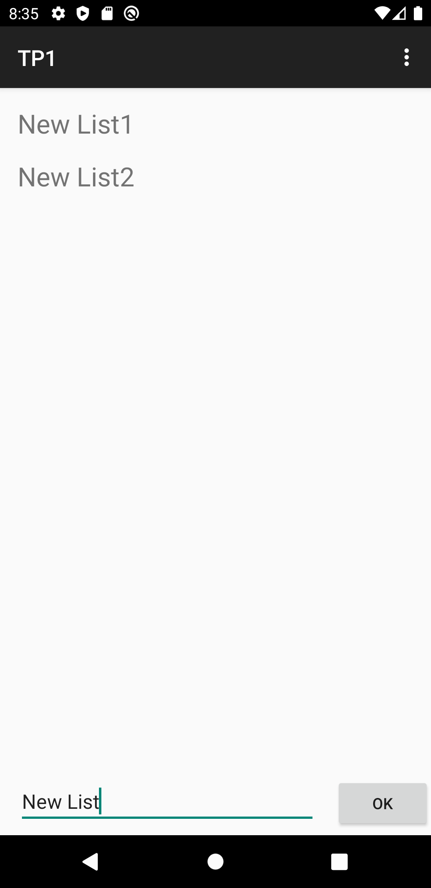
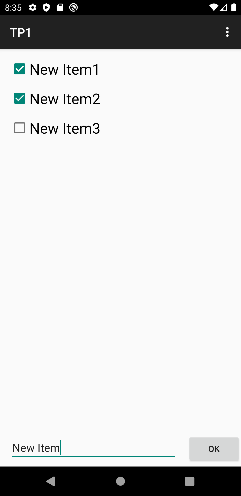
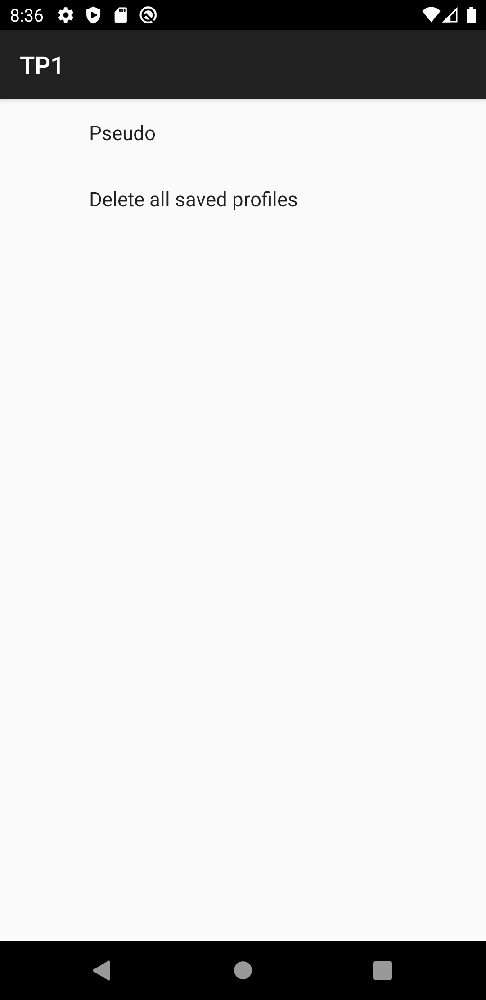
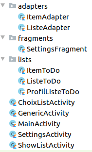
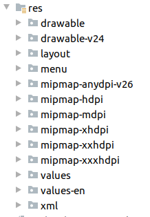

# Séquence 1

**Léo Leplat**

*le 25/05/2020*

## Introduction

Le but de ce TP est de créer un début d'application de to-do-list. Elle est composée des écrans suivants :

* L'écran principal qui permet de saisir un pseudo :

* L'écran présentant la liste des to-do-list de l'utilisateur identifié par son pseudo :

* L'écran présentant les items d'une liste de l'utilisateur :

* L'écran de paramètres permettant de modifier le pseudo actuel et de supprimer toutes les listes enregistrées :

## Analyse

### Hiérarchie du projet

Voici la hiérarchie du projet des fichiers sources :

Les activités sont situées à la racine du projet. Un package `adapters` contient les deux adapters pour la gestion des listes. Un package `lists` contient les trois classes de listes, et un package `fragments` contient le fragment correspondant à l'écran des paramètres.

En ce qui concerne les listes, j'ai utilisé le diagramme donné en consignes, auquel j'ai ajouté quelques fonctions dont j'avais besoin.

En ce qui concerne les activités, les trois activités principales dérivent d'une `GenericActivity` qui permet de ne pas avoir à réécrire le code gérant l'affichage du menu.

Voici la hiérarchie des ressources du projet :

Ici on peut juste noter le dossier `values-en` qui s'occupe de traduire l'application en anglais selon la langue du système (la langue par défaut de l'application est le français).

### Fonctionnalités

* Sauvegarde du pseudo actuel :
  * Le pseudo actuel est sauvegardé dans les préférences de l'application.
  * On utilise la librairie `androidx.preference` qui a l'avantage de ne pas être obsolète.
  * Cette librairie nécessite d'utiliser un fragment dans la page des paramètres (il s'agit d'une classe qui va hériter de `PreferenceFragmentCompat`).

* Sauvegarde des listes dans un fichier :
  * Les listes sont sauvegardées sous forme JSON dans un fichier `players`.
  * Au moment du lancement de l'application, l'existence du fichier est vérifiée.
  * On lit le contenu du fichier avec la fonction `.readText()`.
  * On écrit dans le fichier avec la fonction `.write(text)`.

* Listes sauvegardées sous le format JSON :
  * On passe du format JSON à String grâce à la fonction `.fromJson()` appliquée à un objet de type `Gson`.
  * On passe du format String au format JSON avec la fonction `.toJson()` appliquée à un objet créé avec `GsonBuilder().setPrettyPrinting().create()`.

* Auto-complétion des pseudos :
  * On utilise un composant `AutoCompleteTextView` pour ajouter l'auto-complétion sur le formulaire de saisie du pseudo.
  * La liste des pseudos est récupérée en regardant dans le fichier `players`. Elle est donnée au composant à l'aide d'un *adapter*.
  * La liste des pseudos suggérés est mise à jour à chaque fois que l'activité `MainActivity` est lancée (avec la fonction `onStart()`).

* Affichage de la liste des listes de tâches et de la liste des items :
  * On utilise des `RecyclerView`.
  * On utilise un `LinearLayout` pour organiser la liste.
  * Pour l'*adapter*, on créé une classe qui dérive de `RecyclerView.Adapter<RecyclerView.ViewHolder>`. Cette classe possède les éléments importants suivants :
    * Une fonction `setData` qui va mettre à jour les données de la liste.
    * Une fonction `onCreateViewHolder` qui va *inflate* les items de la liste.
    * Une fonction `onBindViewHolder` qui va modifier les paramètres de chaque item.
    * Une *inner* classe `ItemViewHolder` qui va permettre de mettre des *listeners* sur les items. Dans le cas de la liste d'item d'une to-do list, cette classe va également cocher les tâches selon les informations stockées dans l'application.
    * Une interface `ActionListener` pour déclarer la fonction qui va se lancer lors d'un clique sur un item.

* Interdiction de créer deux to-do lists ou deux items de même nom :
  * Si l'utilisateur veut créer une liste ou un item de même nom qu'une liste ou un item déjà existant, l'application affiche un *toast* indiquant que cette opération n'est pas possible.

* Suppresion de l'ensemble des listes sauvegardées :
  * L'écran de paramètres permet de redéfinir le pseudo actuel et de supprimer l'ensemble des listes sauvegardées.
  * Cela se passe dans le `SettingsFragment` où on utilise un `.onPreferenceClickListener`.
  * Un *toast* de confirmation de suppression se lance lorsque l'utilisateur appuie sur ce bouton.

* Gestion des langues :
  * L'application est de base en français mais se traduit en anglais lorsque la langue du système est anglaise.
  * Cela se fait car toutes les chaînes de caractères sont des ressources.

Le détail de chaque fonctionnalité est décrite dans le code source.

## Perspectives et conclusion

Cette application a permis de mettre en application plusieurs fonctionnalités vues en cours, et quelques améliorations présentées dans les slides. Toutefois, pour que l'application soit vraiment fonctionnelle, il faudrait ajouter les fonctionnalités suivantes :

* Ajouter la possibilité de supprimer les to-do list et les items.
* Implémenter une fonction de recherche.
* Ajouter des dates limites pour les tâches, avec un la possibilité d'ajouter une alarme ou d'utiliser des notifications.
* Ajouter des éléments de personnalisation de l'interface.
* Ajouter la possibilité de partager des to-do lists entre plusieurs personnes.

## Bibliographie

* [Cours de PMR](https://moodle1920.centralelille.fr/mod/url/view.php?id=19009) et screencast associés.
* [Cours de Mohamed Boukadir](https://moodle1920.centralelille.fr/mod/page/view.php?id=19605)
* [Les Android Developer guides](https://developer.android.com/guide)
* [StackOverflow](https://stackoverflow.com/)
